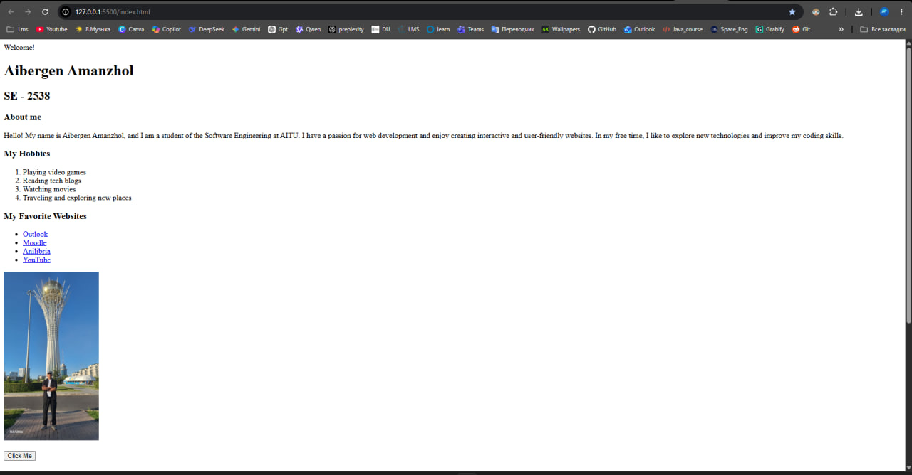
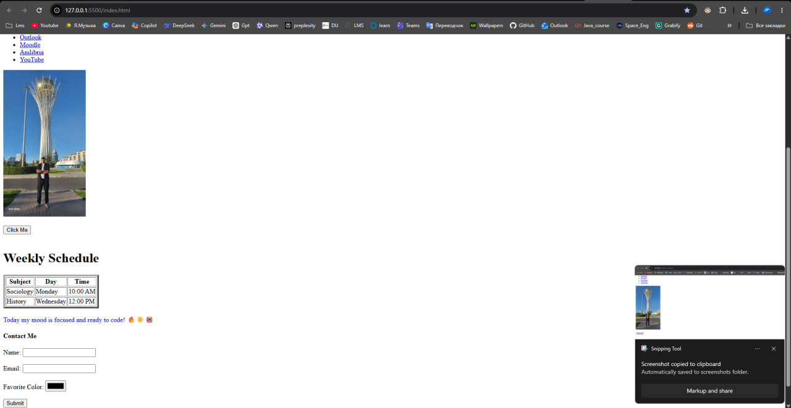
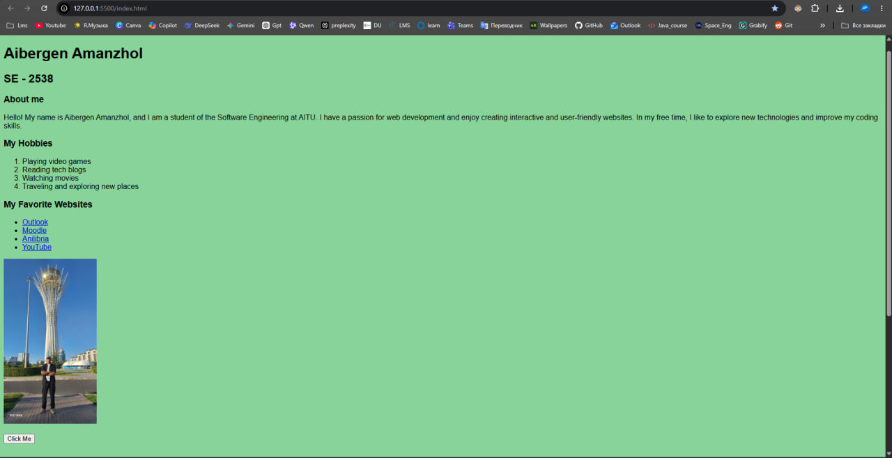
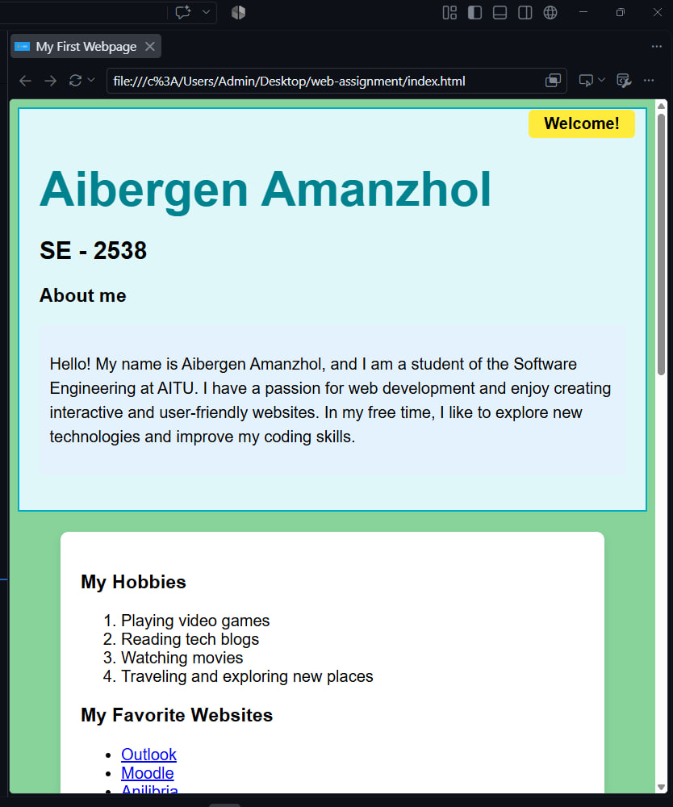

# Assignment 1. HTML & CSS Basics

**Name:** Aibergen Amanzhol  
**Group:** SE - 2538  

## Summary of Work Process
In this assignment, I developed my first personal webpage to practice foundational web development skills. I structured the content using HTML tags for text, lists, tables, and forms. After establishing the structure, I applied styling using inline, internal, and external CSS. I utilized the CSS Box Model, various selectors, sizing units, and positioning properties to create a clean layout. Finally, the project was published online using GitHub Pages.

---

## Completed Tasks

### Part 1. Introduction to HTML
- Created the fundamental structure of the webpage using the basic HTML boilerplate.
- Added structured text (headings and paragraphs) to introduce myself.
- Created ordered and unordered lists to display my hobbies and favorite websites.
- Inserted a personal photo, hyperlinks to external resources, and a clickable button.

### Part 2. Intermediate HTML
- Built a table to display my weekly class schedule.
- Used a table to create a two-column layout for a menu and main content (Optional Challenge).
- Added typing emojis to text elements.
- Created an interactive contact form with text, email, and color input fields, along with a submit button.

### Part 3. Introduction to CSS
- Applied inline CSS to specifically change the color of a paragraph.
- Used internal CSS within the `<head>` to set the body background and font family.
- Created an external `style.css` file and linked it to the HTML document.
- Demonstrated the use of element (e.g., `p`, `img`), class (`.highlight`), and ID (`#main-heading`) selectors to apply distinct styles.

### Part 4. Intermediate CSS
- Added a custom `.png` favicon to the website tab.
- Grouped content logically using `
` tags and styled them appropriately.
- Implemented the Box Model by adjusting padding, margins, and borders.
- Used various CSS positioning methods (static, relative, absolute) and sizing units (px, %, em, rem).
- Created a structural layout using `float` and `clear` properties.
- Deployed and published the final webpage via GitHub Pages.

---

## Final Project Screenshots

*(Below are the screenshots of the completed webpge demonstrating all the implemented features from Parts 1-4)*

